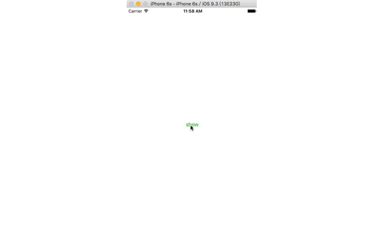

###使用###
* 声明QYReversalView对象，分别向foreView和backView中加入翻转的前后View

		reversalView = QYReversalView(frame: CGRectMake(0, 0, 300, 400))
        reversalView.layer.position = CGPointMake(self.view.frame.width/2, self.view.frame.height/2)
        let foreImageView = UIImageView(frame: CGRectMake(0, 0, reversalView.frame.width ,reversalView.frame.height))
        foreImageView.image = UIImage(named: "img")
        reversalView.foreView.layer.cornerRadius = 5
        reversalView.foreView.layer.masksToBounds = true
        reversalView.foreView.addSubview(foreImageView)
        let backImageView = UIImageView(frame: CGRectMake(0, 0, reversalView.frame.width, reversalView.frame.height))
        backImageView.image = UIImage(named: "shirley")
        reversalView.backView.layer.cornerRadius = 5
        reversalView.backView.layer.masksToBounds = true
        reversalView.backView.addSubview(backImageView)
        
* 调用reversalView.show();

###示例##
